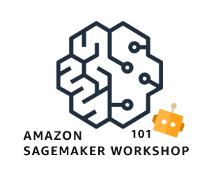

# Amazon SageMaker 101 Workshop 

 

Nesse workshop iremos efetuar diferentes etapas da criação de um modelo de Machine Learning dentro do [Amazon SageMaker](https://aws.amazon.com/pt/sagemaker/), introduzindo o serviço, automatizando a criação e implantação de modelos e por fim automatizando o processo de melhoria do modelo baseado em revisões com o [Amazon A2I](https://aws.amazon.com/pt/augmented-ai/).

Acompanhe o workshop via readthedocs: https://workshop-amazon-sagemaker.readthedocs.io/pt/latest/

## Referências

* https://github.com/awslabs/amazon-sagemaker-mlops-workshop 
* https://aim357.readthedocs.io/en/latest/index.html 
* https://github.com/data-science-on-aws/workshop
* https://github.com/aws-samples/aws-sagemaker-build 
* https://www.sagemakerworkshop.com/introduction/
* https://github.com/aws-samples/amazon-sagemaker-custom-container
* https://github.com/awslabs/amazon-sagemaker-examples/tree/master/advanced_functionality/custom-training-containers
* https://aws.amazon.com/blogs/machine-learning/classifying-high-resolution-chest-x-ray-medical-images-with-amazon-sagemaker/

## Licença

Este código de amostra está disponível sob a licença MIT-0. Veja o arquivo de LICENÇA.
