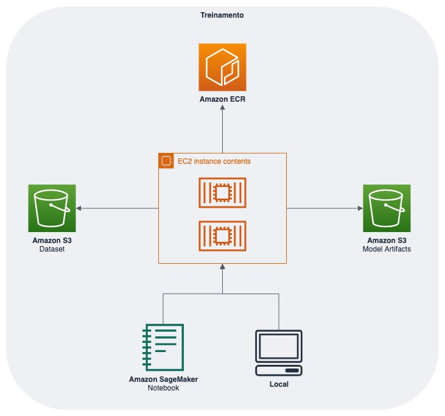
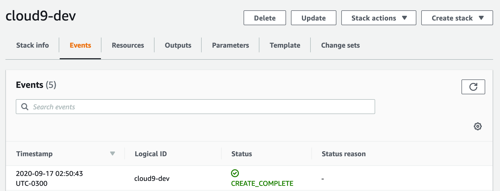
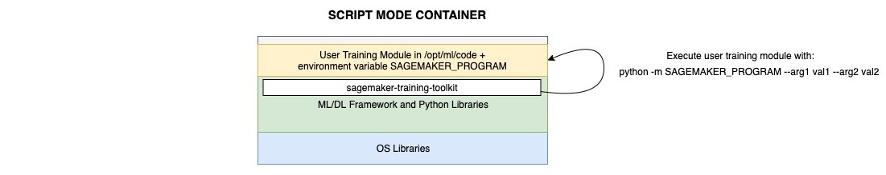
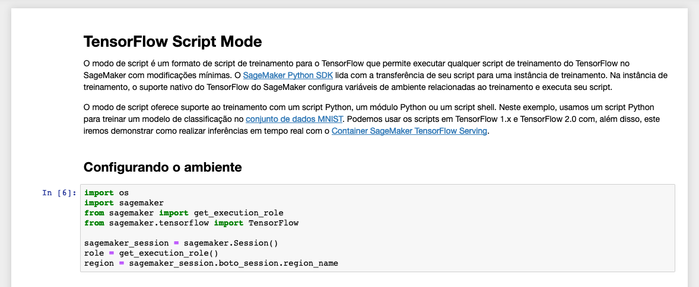
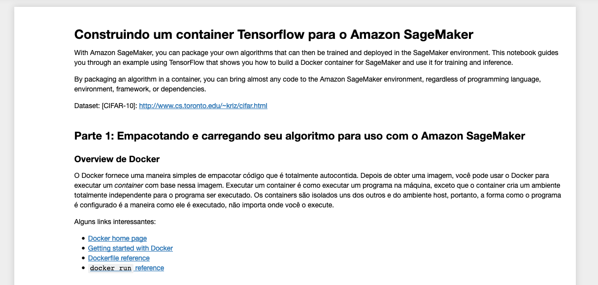
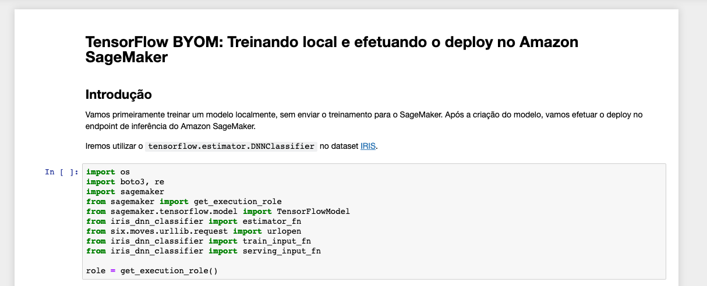

*********************************
Customizando o Amazon SageMaker
*********************************

Nessa etapa do workshop iremos utilizar frameworks de mercado e customizar nossas próprias imagens para
serem utilizadas com o Amazon SageMaker.

O Amazon SageMaker funciona da seguinte forma:

Com essa arquitetura podemos customizar o SageMaker para utilizar nossos próprios containers Docker.

Iremos criar uma instância gerenciada com o nosso ambiente de desenvolvimento Cloud9 já configurado com Docker. Para isso clique no botão abaixo:

.. image:: _static/cloudformation_launch_stack.png
   :target: https://console.aws.amazon.com/cloudformation/home?region=us-east-1#/stacks/new?stackName=sagemaker-workshop&templateURL=https://aws-brasil-workshops.s3.amazonaws.com/workshop-amazon-sagemaker/container_cloudformation.yml
   :alt: Cloudformation launch Stack

Aguarde a criação do ambiente e siga os tópicos seguintes.

Utilizando frameworks com o Script Mode
------------------------------------------

O Amazon SageMaker fornece containers predefinidos para oferecer suporte a diferentes frameworks, como Apache MXNet, TensorFlow, PyTorch e Chainer.
Ele também oferece suporte a bibliotecas de machine learning, como scikit-learn e SparkML, fornecendo imagens de Docker predefinidas. Se você usar o SageMaker Python SDK, elas serão implantadas usando sua
respectiva classe de Estimator do SageMaker SDK. Nesse caso, você pode fornecer o código Python que implementa seu algoritmo e configurar a imagem predefinida para acessar seu código como um ponto de entrada.

Para prosseguir, no ambiente Jupyter já configurado vá para a pasta **labs/02-sagemaker-custom/script-mode** e abra o notebook **sagemaker-custom-01.ipynb**.
Leia e execute cada passo do notebook.

Criando o seu próprio container
------------------------------------------

No SageMaker, também é possível você utilizar um container próprio, tanto para o treinamento como para a inferência. A estrutura funciona da seguinte forma:

.. image:: _static/02-sagemaker-custom/sg_03.gif

Para prosseguir, no ambiente Jupyter já configurado vá para a pasta **labs/02-sagemaker-custom/byoc-mode** e abra o notebook **sagemaker-custom-02.ipynb**.
Leia e execute cada passo do notebook.

Importando seu próprio modelo
------------------------------------------

Caso você já tenha um modelo treinado fora do Amazon SageMaker e queira utilizar, também é possível.
Nesse tópico iremos demonstrar como criar um endpoint de inferência utilizando um modelo de classificação
criado a partir do framework Tensorflow sem a utilização dos containers Script Mode.

Para prosseguir, no ambiente Jupyter já configurado vá para a pasta **labs/02-sagemaker-custom/byom-mode** e abra o notebook **sagemaker-custom-03.ipynb**.
Leia e execute cada passo do notebook.

**Obrigado pela participação no workshop! Agora você pode efetuar treinamentos e inferências em um ambiente escalável e com alta disponibilidade.**

.. important:: Iremos atualizar esse workshop com mais conteúdos. Então favorite e de uma estrela em nosso repositório =)
