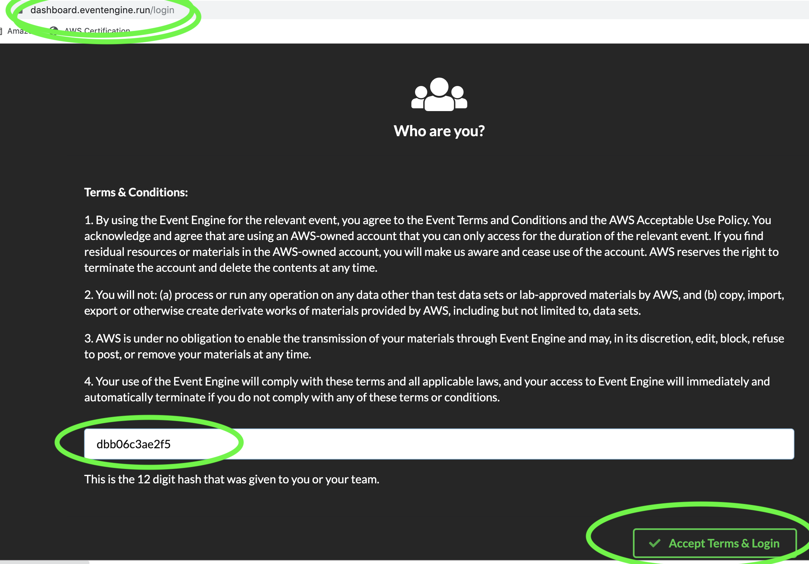
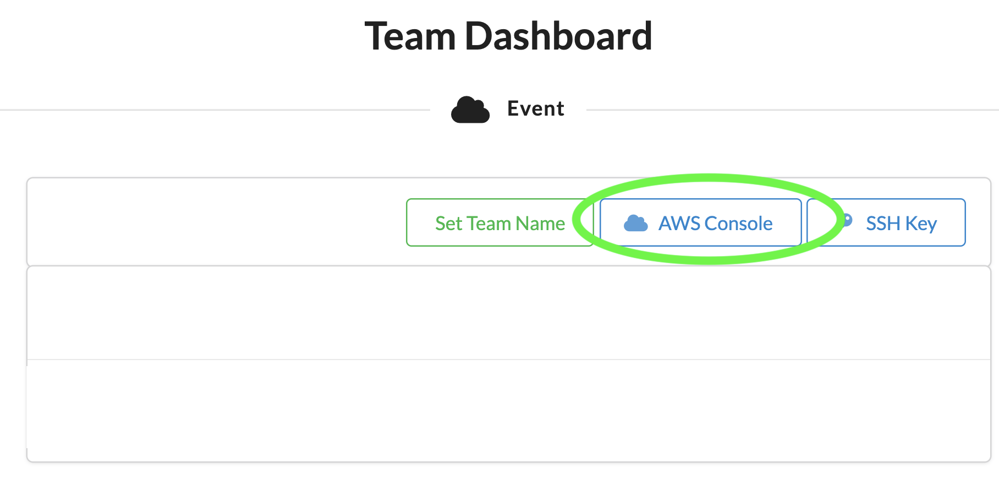
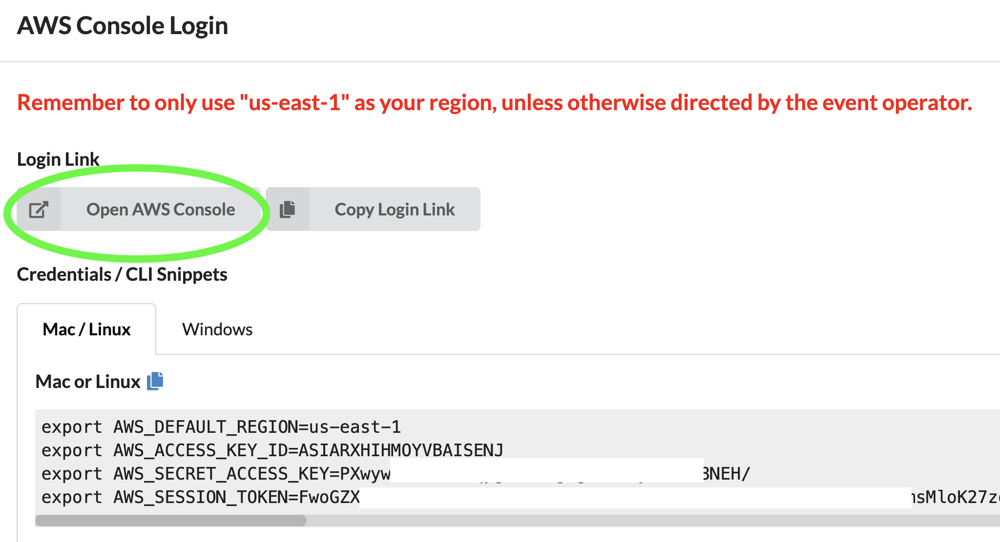

************************************************
Workshop Amazon SageMaker
************************************************

Nesse workshop iremos efetuar diferentes etapas da criação de um modelo de Machine Learning dentro do Amazon SageMaker, introduzindo o serviço, automatizando a criação e implantação de modelos e por fim automatizando o processo de melhoria do modelo baseado em revisões com o Amazon A2I.

Antes de começarmos
--------------------
.. note:: Caso esteja efetuando esse workshop acompanhado(a) de algum(a) organizador(a) da AWS verifique se o Event Engine estará disponível para o workshop.

Acesse a página da plataforma **Event Engine**: https://dashboard.eventengine.run/login

Entre o **"hash" de 12 dígitos** que o(a) Arquiteto(a) da AWS providenciou e clique em **"Accept Terms & Login"**:

Clique em **AWS Console** e após isso em **Open AWS Console**

Pronto! Agora que já temos uma conta AWS disponível podemos prosseguir com o workshop.

.. toctree::
   :maxdepth: 2
   
   intro_sagemaker
   custom_container
   inferences
   mlops
   ml_review