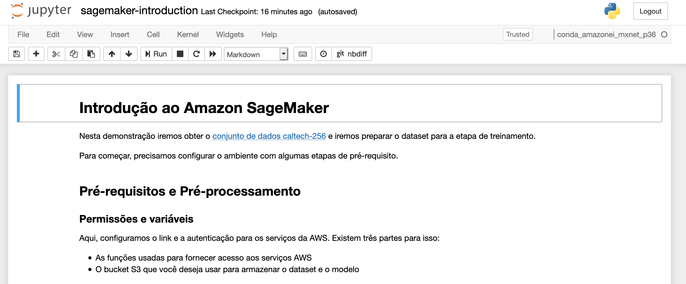
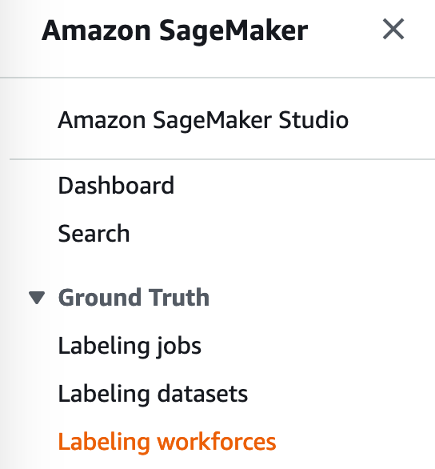
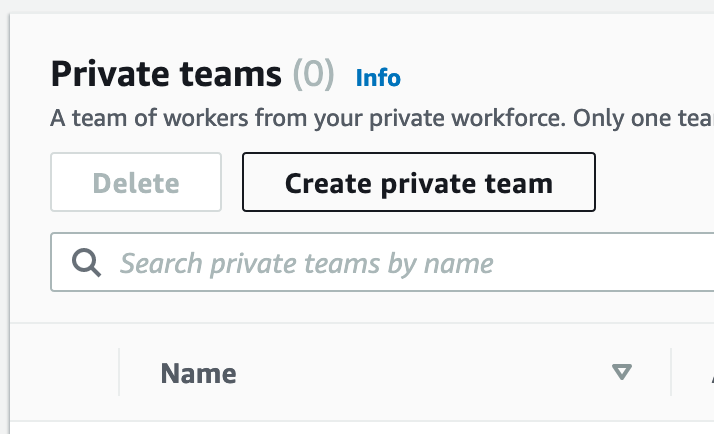
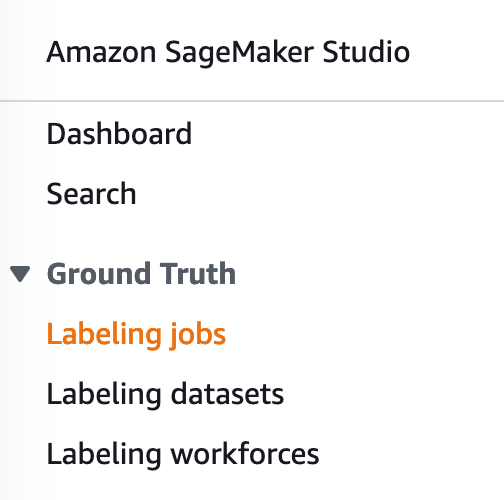
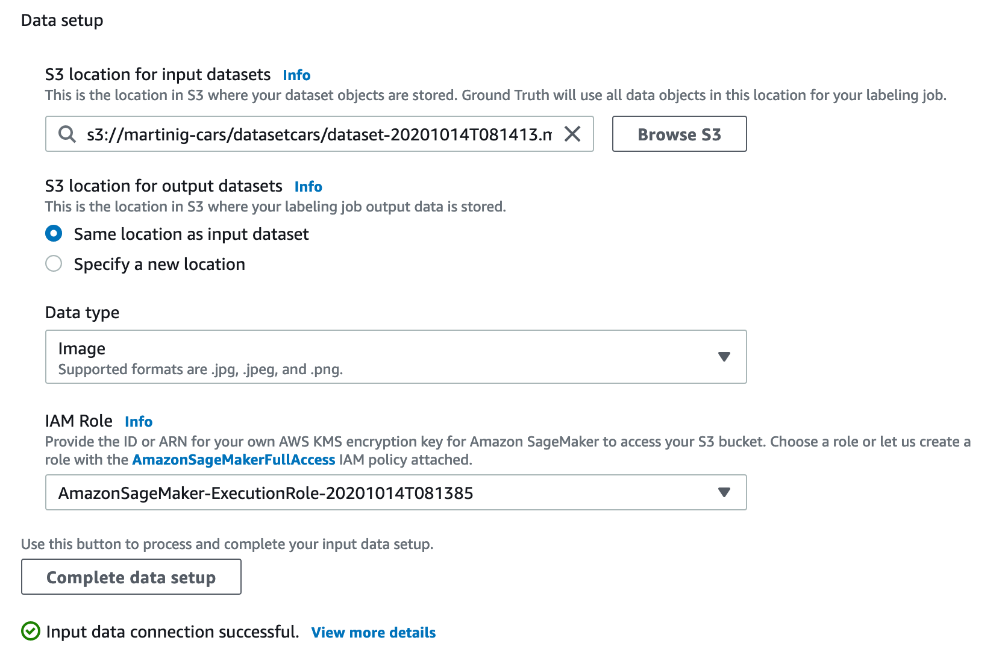
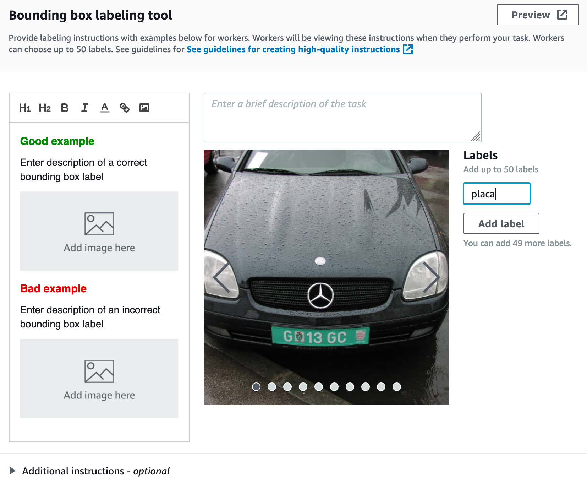
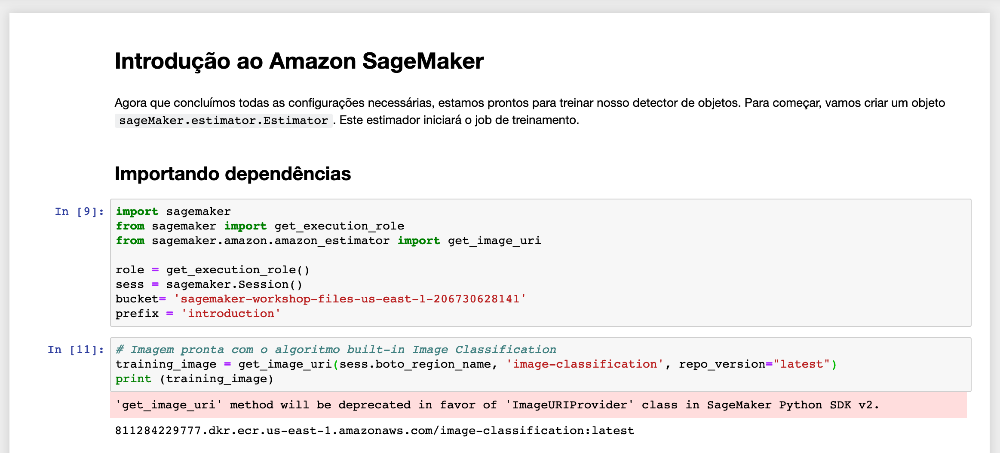

************************************************
Introdução ao Amazon SageMaker
************************************************

Nessa etapa do workshop iremos testar algumas das principais features do Amazon SageMaker.

.. important:: Verifique com o(a) organizador(a) da AWS se o acesso a instâncias com GPU estão disponíveis para o workshop.

Explorando nosso dataset com o Jupyter
------------------------------------------------

Para iniciar, iremos explorar um pouco o dataset através do ambiente `Jupyter <https://jupyter.org/>`_. O Jupyter Notebook é
uma aplicação web de código aberto que permite criar e compartilhar documentos que contêm código, equações, visualizações e texto narrativo.
Os usos incluem: limpeza e transformação de dados, simulação numérica, modelagem estatística, visualização de dados, aprendizado de máquina e muito mais.

Para a demonstração, iremos utilizar o dataset `Caltech-256 <http://www.vision.caltech.edu/Image_Datasets/Caltech256/>`_  que possui 30608 imagens de 256 objetos diferentes.

Iremos criar uma instância gerenciada com o nosso ambiente de desenvolvimento Jupyter já configurado. Para isso clique no botão abaixo:

.. image:: _static/cloudformation_launch_stack.png
   :target: https://console.aws.amazon.com/cloudformation/home?region=us-east-1#/stacks/new?stackName=sagemaker-workshop&templateURL=https://aws-brasil-workshops.s3.amazonaws.com/workshop-amazon-sagemaker/notebook_cloudformation.yml
   :alt: Cloudformation launch Stack

Aguarde a criação do ambiente

.. image:: _static/01-sagemaker-introduction/sg_03.png

Pronto! Já possuimos nossa instância com o Jupyter configurado e pronto para nossa exploração.

No console da AWS procure pelo serviço **Amazon SageMaker**

.. image:: _static/01-sagemaker-introduction/sg_01.png

Na página do Amazon SageMaker, ao lado esquerdo, clique em **Notebook instances**

.. image:: _static/01-sagemaker-introduction/sg_02.png

Para acessar a instância criada clique em **Open Jupyter**

.. image:: _static/01-sagemaker-introduction/sg_04.png

.. image:: _static/01-sagemaker-introduction/sg_05.png

O repositório com o conteúdo do workshop já foi clonado para a instância. Agora iremos abrir nosso primeiro notebook.

No ambiente Jupyter vá para a pasta **labs/01-sagemaker-introduction** e abra o arquivo **sagemaker-introduction-01.ipynb**

Leia e execute cada estágio do notebook em Python clicando em **Run** ou através do atalho ``Shift+Enter``.

Rotulação dos dados com Ground Truth
------------------------------------------------

Como vimos no tópico anterior, rapidamente lançamos um ambiente de desenvolvimento em Jupyter e exploramos brevemente nosso dataset.
Para esse workshop iremos trabalhar com um problema de detecção de objetos utilizando algoritmos supervisionados.

.. note:: A aprendizagem supervisionada é útil nos casos em que uma propriedade (rótulo) está disponível para um determinado conjunto de dados (conjunto de treinamento).

Neste exemplo, vamos utilizar outro dataset público `"500 Images of the Rear View" <http://www.zemris.fer.hr/projects/LicensePlates/english/results.shtml>`_. Iremos demonstrar como é possível gerar rótulos em nosso dataset com o auxílio do `Amazon SageMaker Ground Truth <https://aws.amazon.com/pt/sagemaker/groundtruth/>`_.

Para começar, precisamos efetuar o download do dataset, para isso, abra o terminal do Jupyter notebook e execute os comandos:

.. code-block:: Shell
   
   cd SageMaker
   cd sagemaker-101-workshop/labs/01-sagemaker-introduction
   wget www.zemris.fer.hr/projects/LicensePlates/english/baza_slika.zip
   mkdir datasetcars
   find . -name "baza_slika.zip" -type f -exec unzip -jd "datasetcars/" "{}" "*.jpg" \;

Modifique o primeiro notebook que utilizamos para fazer o upload das imagens em um bucket do Amazon S3. Em seguida, vamos criar uma força de trabalho para a rotulação. Vá para a console do Amazon SageMaker e clique em **Labeling workforces**.

Vá para a aba **Private**, clique em **Create private team** e coloque o nome de **aws-sagemaker-workshop-team**, finalize a criação.

Entre no time e adicione novos especialistas clicando em **Add workers to team**, digite seu e-mail.

.. image:: _static/01-sagemaker-introduction/sg_10.png

Com os especialistas registrados, podemos criar o trabalho de rotulação. Ao lado esquerdo, clique em **Labeling jobs**.

Selecione **Create labeling job** e coloque o nome de **aws-workshop-cars**. Adicione o caminho do bucket que você efetuou o upload do dataset, selecione **Image** como **Data Type** e crie uma nova **Role**.
Após isso, clique em **Complete data setup**.

Para a task type selecione **Bounding Box**.

Na página seguinte iremos selecionar o time de especialistas que criamos anteriormente. Na configuração da ferramente apenas adicione uma label com o nome de **placa**.

Os especialistas irão receber um e-mail com acesso a plataforma web para efetuar a rotulação. Após finalizado, podemos efetuar o treinamento do modelo.

No ambiente Jupyter vá para a pasta **labs/01-sagemaker-introduction** e abra o arquivo **car-plate-recognition.ipynb**

Leia e execute cada estágio do notebook em Python clicando em **Run** ou através do atalho ``Shift+Enter``.

Treinamento e Inferência com algoritmos built-in
------------------------------------------------

Agora que já possuimos os dados para o treinamento, iremos utilizar um `algoritmo built-in do Amazon SageMaker <https://docs.aws.amazon.com/pt_br/sagemaker/latest/dg/algos.html>`_ chamado `Image Classification <https://docs.aws.amazon.com/pt_br/sagemaker/latest/dg/image-classification.html>`_.
Conseguimos resolver muitos problemas com os algoritmos built-in e sem a necessidade de ter o conhecimento de um framework de Machine Learning e nem desenvolver um algoritmo.

No notebook iremos definir os hiperparâmetros, as configurações de treinamento e iremos iniciar um treinamento distribuído através das APIs do Amazon SageMaker. Após a finalização do treinamento
podemos criar um endpoint de inferência gerenciado pelo próprio Amazon SageMaker.

Para prosseguir, no ambiente Jupyter já configurado vá para a pasta **labs/01-sagemaker-introduction** e abra o notebook **sagemaker-introduction-02.ipynb**.
Leia e execute cada passo do notebook.

Chamadas para o SageMaker em um notebook local (opcional)
----------------------------------------------------------

Podemos também, através de um notebook local efetuar chamadas para o Amazon Sagemaker. Assim, conseguimos fazer toda a exploração e testes localmente e utilizamos o Amazon SageMaker para treinar e hospedar nosso modelo.

Para isso, é necessário configurar as credenciais de acesso da AWS em sua máquina. Siga nossa documentação para instalar o AWS Cli: https://docs.aws.amazon.com/pt_br/cli/latest/userguide/install-cliv2.html

.. note:: O usuário configurado deve possuir acesso ao Amazon SageMaker e ao Amazon S3.

Após isso, instale o Jupyter e as dependências localmente e execute novamente o notebook anterior.

Consumindo nosso modelo
-------------------------

Com o endpoint de treinamento ativo podemos efetuar inferências realizando chamadas de API com os diferentes `SDKs <https://docs.aws.amazon.com/pt_br/sagemaker/latest/dg/image-classification.html>`_  que a AWS disponibiliza. Além da criação do endpoint de inferência, é possível
trabalhar com processamento assíncrono utilizando a `API de Batch Transform <https://docs.aws.amazon.com/pt_br/sagemaker/latest/dg/batch-transform.html>`_.

Para demonstrar o consumo do modelo, podemos executar um exemplo simples em Python utilizando o `SDK Boto3 <https://boto3.amazonaws.com/v1/documentation/api/latest/index.html>`_.

1.Entre na pasta **labs/01-sagemaker-introduction**

2.Instale as dependências no ambiente virtual

.. code-block:: Python
   
   pip install virtualenv
   virtualenv venv
   source venv/bin/activate
   pip install -r requirements

3.Execute o script

.. code-block:: Python

   python call_sagemaker.py