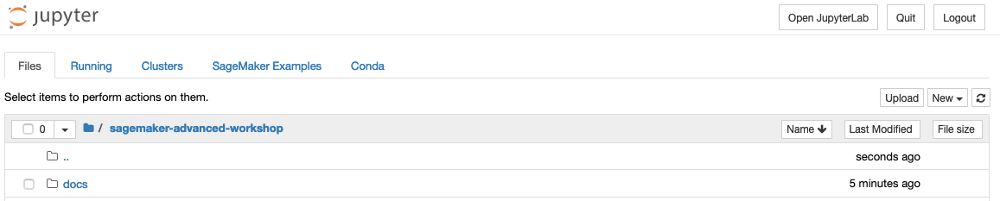

************************************************
Introdução ao Amazon SageMaker
************************************************

Nessa etapa do workshop iremos testar algumas das principais features do Amazon SageMaker.

.. important:: Verifique com o(a) organizador(a) da AWS se o acesso a instâncias com GPU estão disponíveis para o workshop.

Explorando nosso dataset com o Jupyter
------------------------------------------------

Para iniciar, iremos explorar um pouco o dataset através do ambiente `Jupyter <https://jupyter.org/>`_. O Jupyter Notebook é
uma aplicação web de código aberto que permite criar e compartilhar documentos que contêm código, equações, visualizações e texto narrativo.
Os usos incluem: limpeza e transformação de dados, simulação numérica, modelagem estatística, visualização de dados, aprendizado de máquina e muito mais.

Iremos criar uma instância gerenciada com o nosso ambiente de desenvolvimento Jupyter já configurado. Para isso clique no botão abaixo:

.. image:: _static/cloudformation_launch_stack.png
   :target: https://console.aws.amazon.com/cloudformation/home?region=us-east-1#/stacks/new?stackName=sagemaker-workshop&templateURL=https://aws-brasil-workshops.s3.amazonaws.com/workshop-amazon-sagemaker/notebook_cloudformation.yml
   :alt: Cloudformation launch Stack

Aguarde a criação do ambiente

Pronto! Já possuimos nossa instância com o Jupyter configurado e pronto para nossa exploração.

No console da AWS procure pelo serviço **Amazon SageMaker**

.. image:: _static/01-sagemaker-introduction/sg_01.png

Na página do Amazon SageMaker, ao lado esquerdo, clique em **Notebook instances**

.. image:: _static/01-sagemaker-introduction/sg_02.png

Para acessar a instância criada clique em **Open Jupyter**

.. image:: _static/01-sagemaker-introduction/sg_04.png

O repositório com o conteúdo do workshop já foi clonado para a instância. Agora iremos abrir nosso primeiro notebook.

No ambiente Jupyter vá para a pasta **labs/01-sagemaker-introduction** e abra o arquivo **FirstNotebook.ipynb**

Leia e execute cada estágio do notebook em Python clicando em **Run** ou através do atalho ``Shift+Enter``.

Rotulação dos dados com Ground Truth
------------------------------------------------

Como vimos no tópico anterior, rapidamente lançamos um ambiente de desenvolvimento em Jupyter e exploramos brevemente nosso dataset.
Para esse workshop iremos trabalhar com um problema de classificação de imagens utilizando algoritmos supervisionados.

.. note:: A aprendizagem supervisionada é útil nos casos em que uma propriedade (rótulo) está disponível para um determinado conjunto de dados (conjunto de treinamento).

No caso, o dataset público que estamos utilizando já possui esses rótulos, entretanto, iremos demonstrar como é possível gerar rótulos em nosso dataset com o auxílio do `Amazon SageMaker Ground Truth <https://aws.amazon.com/pt/sagemaker/groundtruth/>`_.

Treinamento e Inferência com algoritmos built-in
------------------------------------------------

Chamadas para o SageMaker em um notebook local (opcional)
----------------------------------------------------------

Consumindo nosso modelo
-------------------------